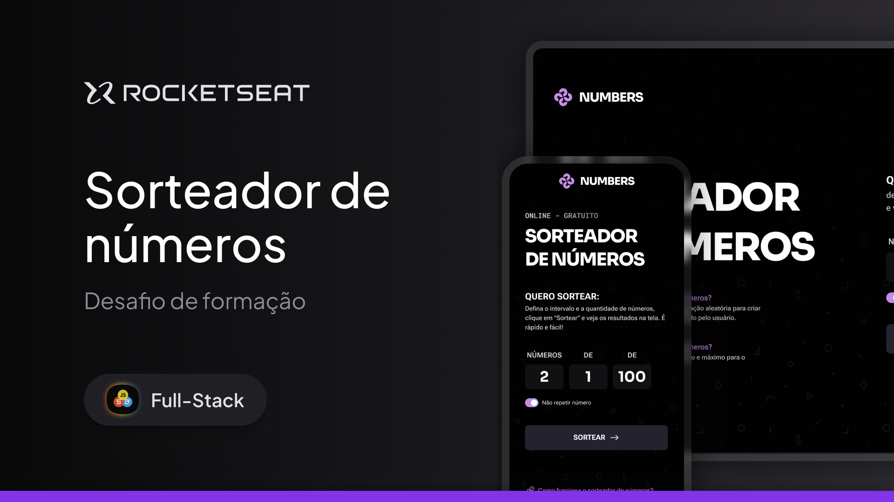

<h1 align="center"> Numbers | Sorteador de números  </h1>

Projeto exclusivo e gratuito, promovido pela Rocketseat para ensino de tecnologias WEB.

 

  

## 🚀 Tecnologias

Esse projeto foi desenvolvido com as seguintes tecnologias:

- HTML
- CSS
- Javascript
- Figma
- Git e Github

## 💻 Projeto

O projeto Numbers, é um sorteador de números aleatórios que te permite escolher a quantidade de números que você gostaria de sortear, decidir o intervalo entre número mínimo e máximo, podendo decidir também se quer que repita ou não os números e acrescentando 1 a cada rodada do sorteio.

## 🔖 Layout

Você pode visualizar o layout do projeto através [DESSE LINK](https://www.figma.com/community/file/1397279380752780744/sorteador-de-numeros). É necessário ter conta no [Figma](https://figma.com) para acessá-lo.

## :memo: Licença

Esse projeto está sob a licença MIT.

---

Feito com ♥ by Rocketseat :wave: [Participe da nossa comunidade!](https://discord.gg/rocketseat)
